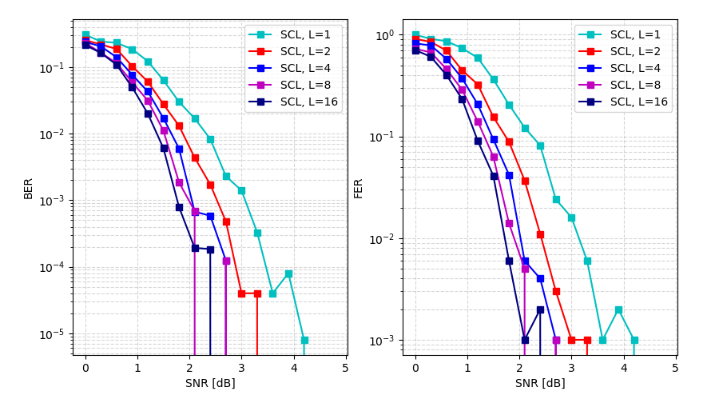

# Polar-Code
SC, SCL, SCL CRC decoders, shortening algorithms.

The code is optimized using Numpy and Numba.
For 512/1024 rate polar code, SC decoder works with the speed of 3000 frame/sec.
Therefore, the throughput can be considered as 1.5 Mbit/sec.

You can reach me from erturkokan16@gmail.com for further details :)
